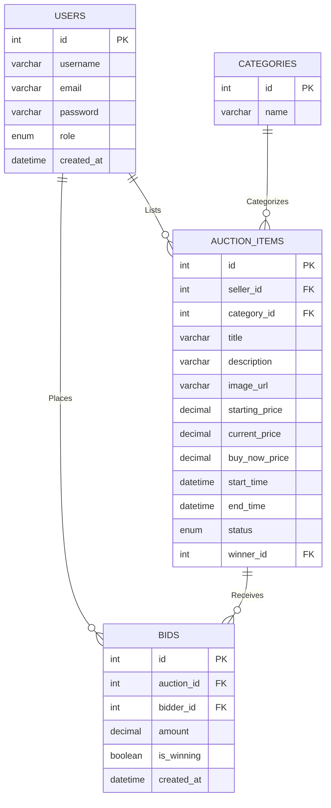

# BidVault: Entity-Relationship (ER) Diagram
This diagram outlines the relational integrity and schema architecture of the BidVault platform. You can copy-paste this Mermaid markdown code directly into your university submission or Markdown viewers (like GitHub).

